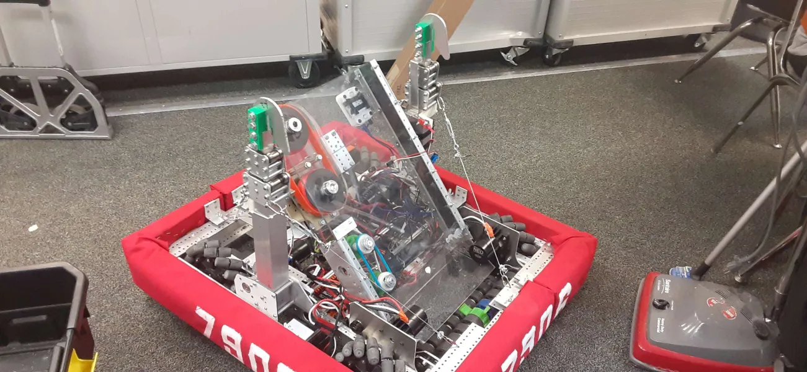
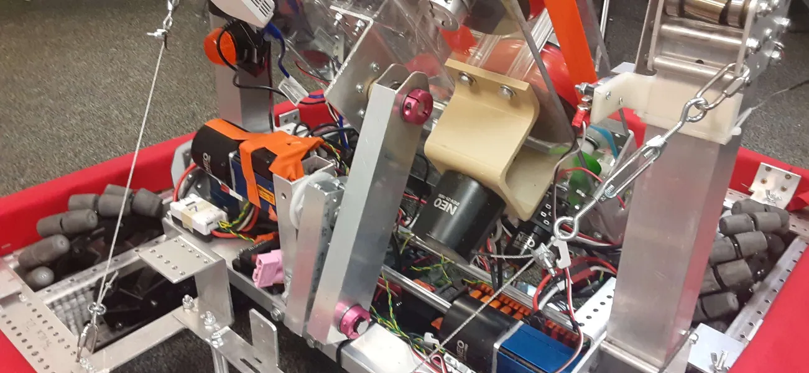

# Seikilos
This is the robot built by the Cottonwood High School robotics team (7906) for the 2024 season. Code named after the longest lasting piece of music, Seikilos Epitaph, to fit the theme this year. Actual robot name decided as Barbie-bot. 

Above                      | Below
:-------------------------:|:-------------------------:
  |  
## Overview
- Mecanum drive
- Designed to collect and shoot notes
- Capable of angling shooter to a good position to shoot
- Two climber arms so that harmony points are possible
- Takes 1 second to shoot a note
- Ground intake only
- Autonomous capable of shooting two notes if positioned in front of speaker, one note from the side
- Field-oriented drive default
## Technical Details
- SparkMAX Motor Controllers on all 10 NEO V1.1 motors
- Uses CAN Bus
- Mecanum wheels
- NavX2 Micro gyroscope through Robo-rio USB-A port
- Both climbers at 48:1 gear ratio
- PID on angling mechanism and climbers, "pseudo-PID" setup on shooter.
- Mapped around two Xbox One controllers, one for driving and collecting, one for climbing, angling, and shooting.
- Preset angles mapped to buttons, manual angle control also mapped.
- Command-based programming
---------------------------------
All of the code was written by me on a time crunch. Not my proudest work, there was a lot I could have done better, but it was my first time dealing with OOP and WPIlib and I learnt a lot. 
